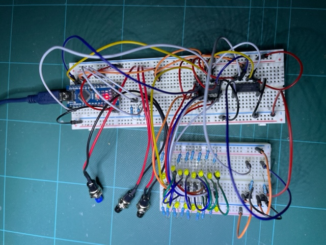

# Habit Calendar

## Summary

A visual calendar to monitor daily habits. For example to track how often you have been for a run or done some form of exercise.

This is inspired by the 
[Everyday Calendar](https://gitlab.com/simonegiertz/the-every-day-calendar) by Simone Giertz. In fact the LED matrix code has been adapted from that project.

## Operation

There is an LED matrix: 12 columns (months) x 31 rows (days).

Unlike Simone's Calendar there are only 3 buttons for control (cost and ease of implementation): +(up), -(down)and toggle. 

Press the toggle button and the currently selected LED is toggled. You can toggle this selection on/off as many times as you wish; but a certain time after the press if there is no more activity on the button, then the selection moves onto the next day (wrapping to the next month as appropriate).

Unlike Simone's there will be a February the 29th; but as there is no external time/date sync, the user will have to skip this on non-leap years.

In normal operation, each day the user can just press the toggle button to light the LED for the day. 

If a day is missed the user willl have to move the currently selected position on by a day.

This is done using the + and - buttons.

On pressing one of these selection button, the LED matrix will change mode and highlight only the currently selected position. The user can then move this forward or backwards using the + or - selection buttons respectively. Pushing and holding for a longer period will move the selection back or forward by a month.

When in selection mode, a period of inactivity on the selection buttons will cause the exit of this state and the LED matrix to be restored.

To reset all LEDs (to off), press all buttons at once.

The LED states will be persisted across a power cycling of the calender.

## Hardware

- 1 x Arduino Nano
- 6 x 74HC595 (shift registers)
- 400 x yellow 3mmm difused LED's (off ebay)
- 12 x BC337 (NPN transistors for driving the months)
- 12 x 330ohm resistors (bias for BC337)
- 31 x 220ohm resistors (LED current limiting to 10-20mA)
- 3 x momentary push switches (+, -, select)
- 3 x 10K resistors (switch pulldowns)

### Current Concerns

**Disclaimer:** I haven't really got a clue about this so may have got this completely wrong!

Component selection:

- Each LED should have 10-20mA through them (due to the 220ohm resistors)
- Each of the 12 BC337 (one per month) should have minimal current through the base due to the 330ohm resistors.
- The BC337 will potentially be taking 31 times the LED current. This means 31*20mA = 620mA. The transistors were picked as they have an Ic max of 800mA. So should be alright.

Note:

From prototyping, the currents described above were as expected when empirically read from a multimeter. This was until I added the Arduino control, which refreshes the LEDs on a monthly basis. In this case the current read on my multimeter was 1/12 of expected. I don't know how to interpret this. Maybe my multimeter was averaging the current, and the components were still experiencing the expected full current at a particular moment in time!

### Prototype

I have currently only prototyped this. I built only the first 8 days of January and February:

 

Note:

In the prototype there is resistor per LED. This is overkill as
## Software

### Button class

All buttons are debounced for noise.

Each button runs it's own state machine and on read presents one of the following states:
- OFF
- ON
- PUSH
- LONG_PUSH

The three buttons are (-, +, toggle).

### Storage class

The state of the LEDs are stored in the Arduino EEPROM.

### LED Matrix class

Adapted from Simone's equivalent, [here](https://gitlab.com/simonegiertz/the-every-day-calendar/-/tree/master/firmware/libraries/EverydayCalendar).

This class drives the six 74HC595 shift registers, which are used for setting the days/months drive states.

The Arduino Timer2 is used to cause 2 interrupts:

(1) The overflow/wrap of the 256 bit timer causes an iterrupt. Interrupt Service Routine (ISR) code is run as a result of the interrupt which drives the LEDs for a single month. The next timer interrupt causes the next month to be displayed, etc. etc. Even though only one month is being displayed at a time, the persistance of vision makes it look like all months are displayed at once.

(2) The other interrupt occurs as a result of a compare register setting for timer 2. This is used for brightness control. Essentially the Output Enable pin(s)
of the 74HC595's are used to disable the outputs to the LED's for a certain period. The ISR for for the timer overflow (point 1 above) diables the LED output (at timer count 0). The ISR for this interrupt just enables the LED outputs. Therefore by setting the compare register you adjust the duty cycle of the power to the LED's. i.e. if you set the compare to 128 you the LED will be on for half the time for the 256 bit timer.

The ISR1 uses the SPI library to load up the 6 74HC595 shift register. Simone's code loads the month first (16 bits with a memcpy), then the days (32-bits) a byte at a time. There is some strange rearranging of the bytes in her code which is due to how the shift registers are wired to the physical LED matrix. Not sure whether I will change this so I just memcpy the whole 32-bits; then just wire the physical matrix accordingly.

The rest of the code is pretty self explanatory.

