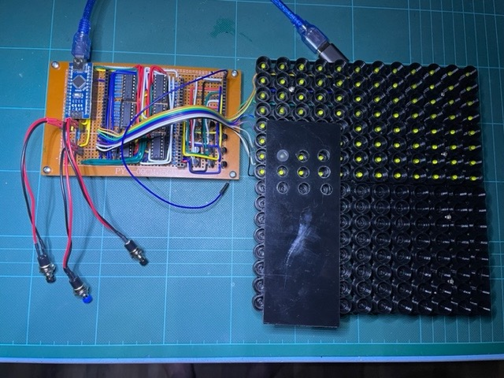

# Habit Calendar

## Summary

A visual calendar to monitor daily habits. For example to track how often you have been for a run or done some form of exercise.

This is inspired by the 
[Everyday Calendar](https://gitlab.com/simonegiertz/the-every-day-calendar) by Simone Giertz. In fact the LED matrix code has been adapted from that project.

## Operation

There is an LED matrix: 12 columns (months) x 31 rows (days).

Unlike Simone's Calendar there are only 3 buttons for control (cost and ease of implementation): +(up), -(down) and toggle. 

Press the toggle button and the currently selected LED is toggled. You can toggle this selection on/off as many times as you wish; but a certain time after the press if there is no more activity on the button, then the selection moves onto the next day (wrapping to the next month as appropriate).

Unlike Simone's there will be a February the 29th; but as there is no external time/date sync, the user will have to skip this on non-leap years.

In normal operation, each day the user can just press the toggle button to light the LED for the day. 

If a day is missed the user will have to move the currently selected position on by a day.

This is done using the + and - buttons.

On pressing one of these selection buttons, the LED matrix will change mode and highlight only the currently selected position. The user can then move this select position forward or backwards using the + or - selection buttons respectively. Pushing and holding for a longer period will move the selection back or forward by a month.

When in selection mode, a period of inactivity on the selection buttons will cause the exit of this state and the LED matrix to be restored.

To reset all LEDs (to off), press all buttons at once.

The LED states will be persisted across a power cycling of the calender.

## Hardware

- 1 x Arduino [Nano](http://ww1.microchip.com/downloads/en/DeviceDoc/ATmega48A-PA-88A-PA-168A-PA-328-P-DS-DS40002061A.pdf)
- 6 x 74HC595 (shift registers)
- 400 x yellow 3mmm difused LED's (off ebay)
- 12 x BC337 (NPN transistors for driving the months)
- 12 x 330ohm resistors (bias for BC337)
- 31 x 220ohm resistors (LED current limiting to 10-20mA)
- 3 x momentary push switches (+, -, select)
- 4 x 10K resistors (3 x switch pulldowns, 1 x 74HC595 Output Enable pull up)

The Output Enable is inverted on the 74HC595. This pins on all six chips are connected to an output pin on the Arduino. I originally didn't use a pull up resistor on this. This caused the leds to be randomly set in the array on startup and when uploading code. This is obviously bad as too much current may be drawn from the shift register outputs. Therefore this should not be omitted!

### Current Concerns

**Disclaimer:** I haven't really got a clue about this so may have got this completely wrong!

Component selection:

- Each LED should have 10-20mA through them (due to the 220ohm resistors)
- Each of the 12 BC337 (one per month) should have minimal current through the base due to the 330ohm resistors.
- The BC337 will potentially be taking 31 times the LED current. This means 31*20mA = 620mA. The transistors were picked as they have an Ic max of 800mA. So should be alright.
- According to the 74HC595 [datasheet](https://www.ti.com/lit/ds/symlink/sn74hc595.pdf?ts=1655985125243), the max current that can be supplied by the outputs is 20mA. I have 12 LEDs (one for each month) hooked up to each output. Due to the multiplexing of the months, only one of these 12 LEDs should be active at a time; so again, it should be alright here.

Note:

From prototyping, the currents described above were as expected when empirically read from a multimeter. This was until I added the Arduino control, which refreshes the LEDs on a monthly basis. In this case the current read on my multimeter was 1/12 of expected. I don't know how to interpret this. Maybe my multimeter was averaging the current, and the components were still experiencing the expected full current at a particular moment in time!

### Building the Calendar

Current state of play is this:

 
See how the calendar build is going [here](./documentation/README.md).

## IDE

The Arduino IDE is very basic and cumbersome to use.

I have therefore switched to using Visual Studio Code, with the PlatformIO extension installed.

Therefore the checked in code here is presented in this format rather than the usual *.ino files.

This is worth it purely for the code completion, proper c/c++ syntax highlighting and source code navigation.

## Software

The code is broken down into the following:
- Main code with Arduino setup() and loop().
- Button class
- LED matrix class (self running via timer interrupts)
- Storage class
- Logging class

### Button class

All buttons are debounced for noise.

Each button runs it's own state machine and on read presents one of the following states:
- OFF (button not pressed)
- ON (button pressed)
- PUSH (transition from ON to OFF. Short on period)
- LONG_PUSH (transition from ON to OFF. Long on period)

The three buttons are (-, +, toggle).


### Storage class

The state of the LEDs are stored in the Arduino EEPROM.

I read the following:
```
 The internal EEPROM has a lifetime of 100,000 write cycles.
```
Assuming I update the EEPROM with every day toggled, then the EEPROM should last 100,000/365 = 274 years!

### LED Matrix class

Adapted from Simone's equivalent, [here](https://gitlab.com/simonegiertz/the-every-day-calendar/-/tree/master/firmware/libraries/EverydayCalendar).

This class drives the six 74HC595 shift registers, which are used for setting the days/months drive states.

The Arduino Timer2 is used to cause 2 interrupts:

(1) The overflow/wrap of the 256 bit timer causes an interrupt. Interrupt Service Routine (ISR) code is run as a result of the interrupt which drives the LEDs for a single month. The next timer interrupt causes the next month to be displayed, etc. etc. Even though only one month is being displayed at a time, the persistance of vision makes it look like all months are displayed at once.

(2) The other interrupt occurs as a result of a compare register setting for timer 2. This is used for brightness control. Essentially the Output Enable pin(s)
of the 74HC595's are used to disable the outputs to the LED's for a certain period. The ISR for for the timer overflow (point 1 above) disables the LED output (at timer count 0). The ISR for this interrupt just enables the LED outputs. Therefore by setting the compare register you adjust the duty cycle of the power to the LED's. i.e. if you set the compare to 128, the LED will be on for half the time of the 256 bit timer.

The ISR1 uses the SPI library to load up the six 74HC595 shift registers. Simone's code loads the month first (16 bits with a memcpy), then the days (32-bits) a byte at a time. There is some strange rearranging of the bytes in her code which is due to how the shift registers are wired to the physical LED matrix. Not sure whether I will change this so I just memcpy the whole 32-bits; then just wire the physical matrix accordingly.

The rest of the code is pretty self explanatory.

### Logging class

Serial.println() and Serial.print() are painful to use when outputting parameter values. There is also no provision for logging levels, to enable the debugging of specific targeted areas of the code.

An individual Logger class can be instatiated per module with it's own log level.

The Logger methods allow usual printf style % formatting.
Life is so much easier!

### Main code

The main code has the usual Arduino setup() and loop() functions.

The buttons and led matrix are instantiated and setup here.

The loop() function reads the button states on each iteration and then goes through a very rudimentary state machine using the button signals for control.

## Backlog

- Document prototyping process.
- Build proper hardware
- Maybe create StateContext class to encapsulate buttons, current day/month, matrix and storage.


