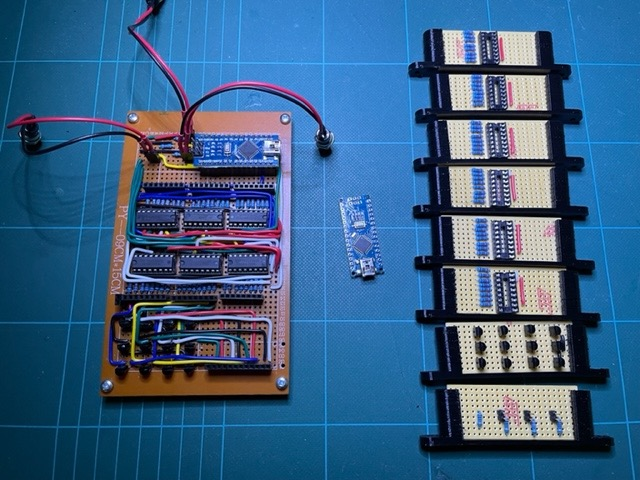
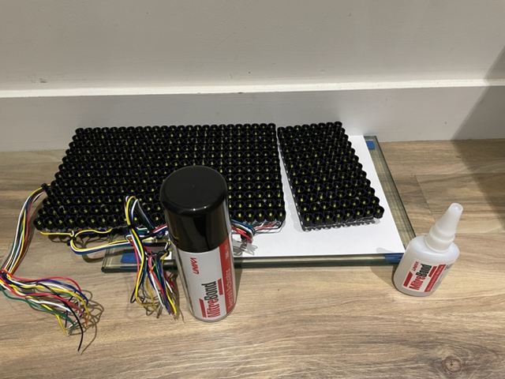
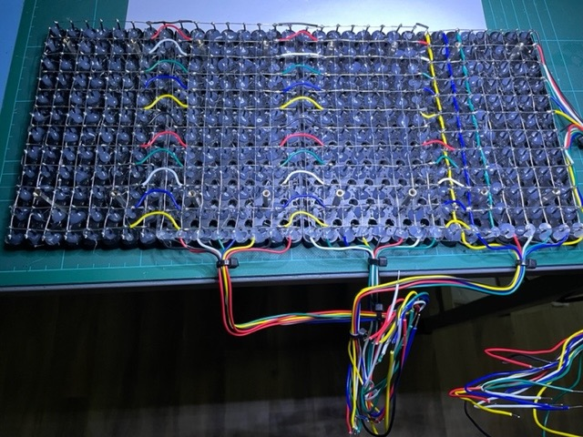
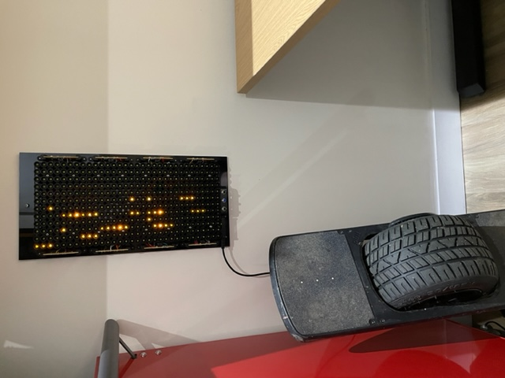
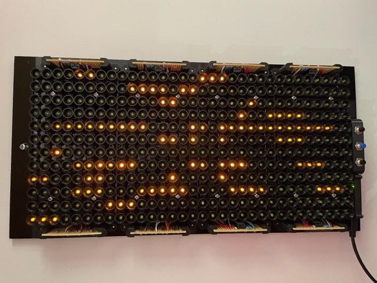
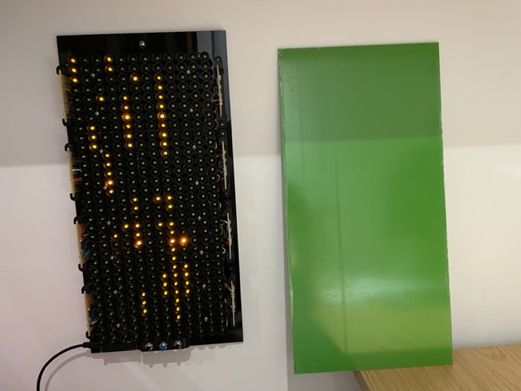

# Habit Calendar Build

## Prototype

I originally prototyped this. I built only the first 8 days of January and February:

 

Note:

In the prototype there is resistor per LED. This is overkill as only one LED will be lit at a time due to the month multiplexing. Therefore for the proper thing I am only going to use 31 resistors rather than 365!

## Strip Board

Bit of a mess, but moved the prototype to strip board:

 

With buttons plugged in:

 

I used sockets for the shift registers and Arduino. This has made the whole thing higher than I expected as I want a low profile frame. We'll see if I ditch these sockets once it is working.

Testing:

 

Note: You can see me trying to add numbers (31 in this case) to the panel lenses. I 3D printed the number on the inside of the lens, airbrushed black into the embossed number, then sandpapered the back to show the black inside the embossed number. I've given up on this as the results were poor.

In light of the above, I need to work out a way of displaying the numbers. However, I like the idea of having no numbers or months, and showing the current selection on a little display, like [this](https://thepihut.com/products/0-91-oled-display-module):

This would sit next to the buttons.

## Final Circuit

The first stripboard was too big to fit under the LED matrix, which meant either making the overall footprint of the calendar longer or deeper. 

I decided I didn't want to do this, so the only other option was to distribute the electronics around the edge of the matrix.

 

Switching this out was also nice as I bought cheap stripboard, for the first board, which was only 1mm thick. It warped like crazy when soldering onto it. The tracks also kept lifting; which I thought was my bad technique and having the soldering iron too hot. The new smaller stripboards were a joy to solder in comparison. The lesson learned - don't cheap out!

## Matrix Build

The LED matrix is 3D printed to provide the appropriate spacing. This was knocked up using Fusion 360.

I modelled a cup around each matrix to hopefully prevent light bleed between days.

Due to printer constraints (physical size and the fact that prints kept failing with larger prints), I have split the whole matrix into 4 panels of 12 month x 8 days.

Here is the test of the first panel:

Then the testing of the second panel, with prototype for front cover and lenses:

 

The matrix panels are glued together, using some float glass and the room skirting to ensure all is square:

It's actually a bit of a marathon to solder up all the panels. Here I am finishing the last one:

## Functional Calendar

The Habit Calendar is functional:

 

I actually quite like this look; but the idea is to finish it off properly! 

The subsequent subsections will describe the cosmetic changes.

## Front Panel

I ordered a couple of 440(H)x220(W)x3(D) coloured sheets from [here](https://www.sheetplastics.co.uk).

I picked a black aluminuum sheet for the back plate, and a green acrylic sheet for the front panel.

The black aluminium is what I have screwed all the components to.

This will have 8mm holes drilled to accept the day lenses

### Front Panel Day Lenses

3D printed to insert through the front panel. The lense will be filled with UV hardening resin. This will then be sanded to make the resin more opaque to hopefully difuse the light from a lit day.

Here is the prototype, along with bubble in the resin:

 

Need to get rid of bubbles in the resin for the 365 real versions!
