# Habit Calendar Build

## Prototype

I originally prototyped this. I built only the first 8 days of January and February:

 

Note:

In the prototype there is resistor per LED. This is overkill as only one LED will be lit at a time due to the month multiplexing. Therefore for the proper thing I am only going to use 31 resistors rather than 365!

## Strip Board

Bit of a mess, but moved the prototype to strip board:

 

With buttons plugged in:

 

I used sockets for the shift registers and Arduino. This has made the whole thing higher than I expected as I want a low profile frame. We'll see if I ditch these sockets once it is working.

Testing:

 

Note: You can see me trying to add numbers (31 in this case) to the panel lenses. I 3D printed the number on the inside of the lens, airbrushed black into the embossed number, then sandpapered the back to show the black inside the embossed number. I've given up on this as the results were poor.

In light of the above, I need to work out a way of displaying the numbers. I liked the idea of having no numbers or months, and showing the current selection on a little display. In the end I used [this](https://thepihut.com/products/0-91-oled-display-module):

I had to cut a rectangular hole throught he front panel, and clamped the LCD in place with some 3d printed parts.

## Final Circuit

The first stripboard was too big to fit under the LED matrix, which meant either making the overall footprint of the calendar longer or deeper. 

I decided I didn't want to do this, so the only other option was to distribute the electronics around the edge of the matrix.

 

Switching this out was also nice as I bought cheap stripboard, for the first board, which was only 1mm thick. It warped like crazy when soldering onto it. The tracks also kept lifting; which I thought was my bad technique and having the soldering iron too hot. The new smaller stripboards were a joy to solder in comparison. The lesson learned - don't cheap out!

The final result:

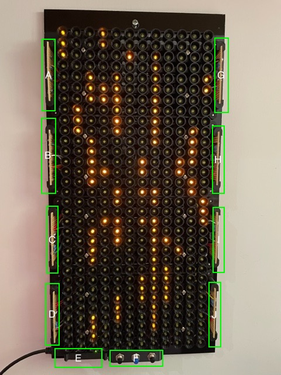

A: Pull downs for switches

B: 12 transistors for controlling months

C: Shift register for months 9-12

D: Shift register for months 1-8

E: Arduino Nano

F: Button Panel

G: Shift register for days 1-8

H: Shift register for days 9-16

I: Shift register for days 17-24

J: Shift register for days 25-32

Note that I changed the position of the Arduino to the other side of the buttons. This was after I built the frame and discovered that I could not fit the USB cables in the left hand position. I used the existing holes in the back and extended a crazy long tab under the buttons. I think I prefer this to drilling more mounting holes in the back and having 2 unused holes.

## Matrix Build

The LED matrix is 3D printed to provide the appropriate spacing. This was knocked up using Fusion 360.

I modelled a cup around each matrix to hopefully prevent light bleed between days.

Due to printer constraints (physical size and the fact that prints kept failing with larger prints), I have split the whole matrix into 4 panels of 12 month x 8 days.

Here is the test of the first panel:

Then the testing of the second panel, with prototype for front cover and lenses:

 

The matrix panels are glued together, using some float glass and the room skirting to ensure all is square:

It's actually a bit of a marathon to solder up all the panels. Here I am finishing the last one:

## Functional Calendar

The Habit Calendar is functional:

 

Notice that some rows are super bright. I discovered that I hadn't done a good job of cutting the tracks on the stripboard for those rows, so the resistors were effectively shorted. Fixed with a craft knife!

I actually quite like this look; but the idea is to finish it off properly! 

The subsequent subsections will describe the cosmetic changes.

## Front Panel

I ordered a couple of 440(H)x220(W)x3(D) coloured sheets from [here](https://www.sheetplastics.co.uk).

I picked a black aluminuum sheet for the back plate, and a green acrylic sheet for the front panel.

The black aluminium is what I have screwed all the components to.

The green acrylic sheet will have 8mm holes drilled to accept the day lenses.

Note: I also ordered a spare grey acrylic sheet for practice drilling.

I set up a drill jig to ensure that the holes look lined up. The clamped yellow spirit level is used as a straight edge to slide the panel up; meaning that I only have to deal with lining up on a single axis rather than two:

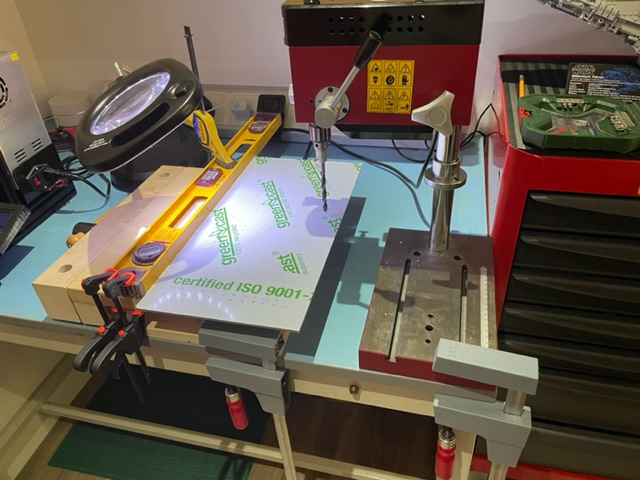

Practice drilling holes on spare grey acrylic panel:

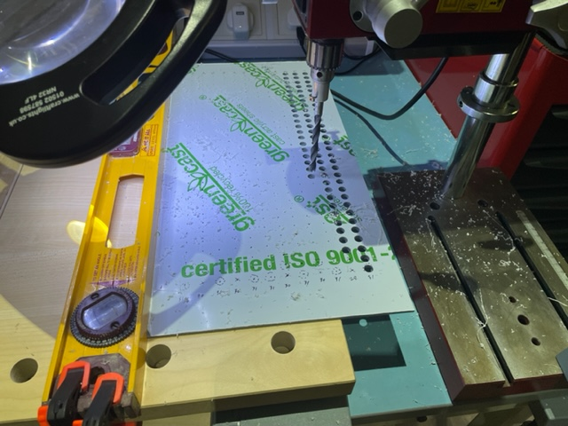

Drilling took a **lot** of time, to the point where I may just stick with the grey practice acrylic rather than the green.

Here is the result (currently held on with blu-tack):

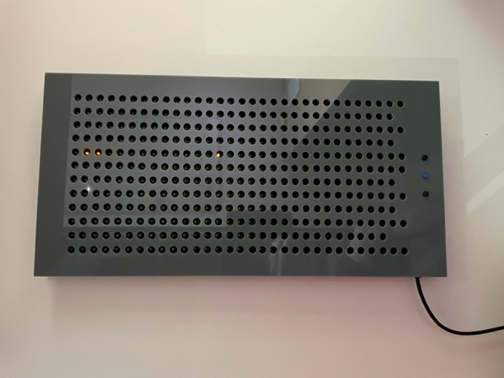

### Front Panel Day Lenses

3D printed to insert through the front panel. The lense will be filled with UV hardening resin. This will then be sanded to make the resin more opaque to hopefully difuse the light from a lit day.

Here is the prototype, along with bubble in the resin:

 

Well, I tried many ways of making the lenses, but none looked very good.

In the end a diffuser (made of glow in the dark filament) was printed. See the final construction section to see this.

## The Frame

I bought a some ash from [here](https://www.surreytimbers.co.uk/product/ash-timber-thins/).

I sawed a couple of strips off this and planed the sides parallel and square; ensuring both strips were of the same dimensions.

I then used a small router table to cut rebates on both sides.

Here is me checking the rebate depths on the calendar. Note each strip would be cut to produce a side and either a top or bottom:

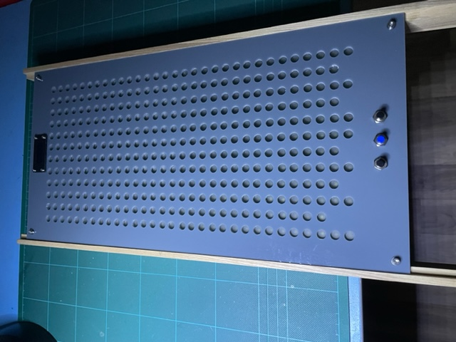

Close up of the rebates:

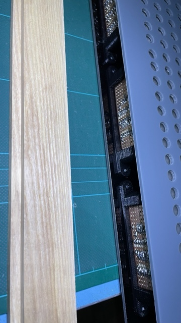

The mitres didn't go quite as expected. I set up a 45 degree shooting board with some scrap plywood. This should have enabled me to get a perfect fit by taking thin shavings. However the endgrain of the ash was just so tough to cut (even with a resharpened lower angle on my low angle jack plane). In the end I used bit powered mitre saw. I spent ages ensuing that the cut was exacly 45 degrees. However, getting the accuracy for the part length was impossible. 

Glued up with Titebond II, using masking tape to clamp. I placed the front panel in during glueup to ensure squareness.

The mitres are by no means perfect, but not too bad when finished:

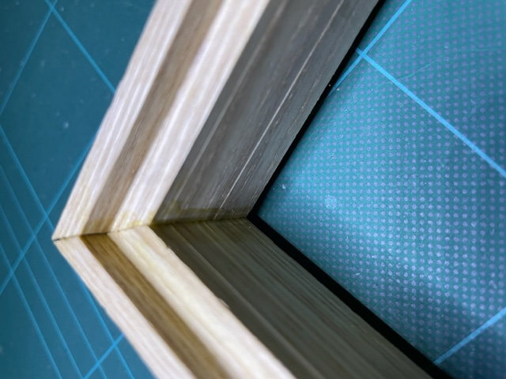

The completed raw frame:

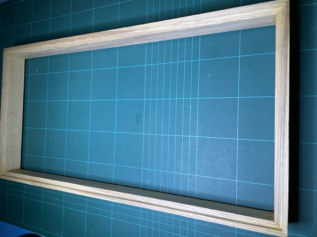 

Finished with a bit of sanding, 2 coats of danish oil, and the a waxing:

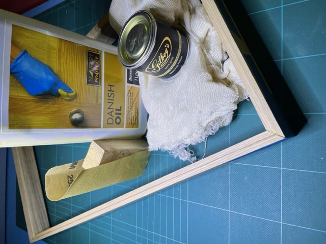 

Test fitting:

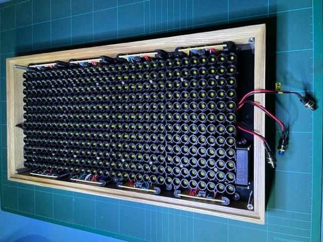

... and a closeup:

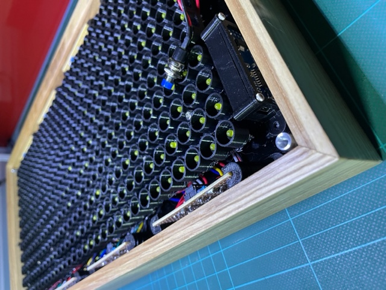

At this point I realise that I need to get power in. 

I was going to use an old laptop power supply to power this, with a buck converter to ramp down to 5V. However, this would mean having to disassemble to get at the USB. Not good if I wanted to do some coding. I therefore opted to power via USB, and get it though the case using [this](https://thepihut.com/products/panel-mount-extension-usb-cable-mini-b-male-to-mini-b-female?variant=31955909073).

Here is a prototype using an offcut from the ash strips:

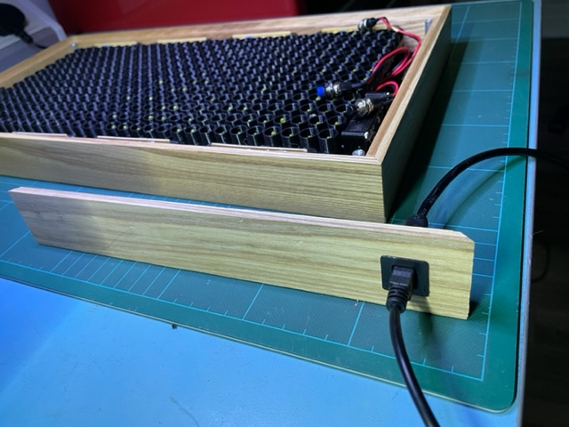 

## Final Assembly

Exciting times as I put it all together for the first time.

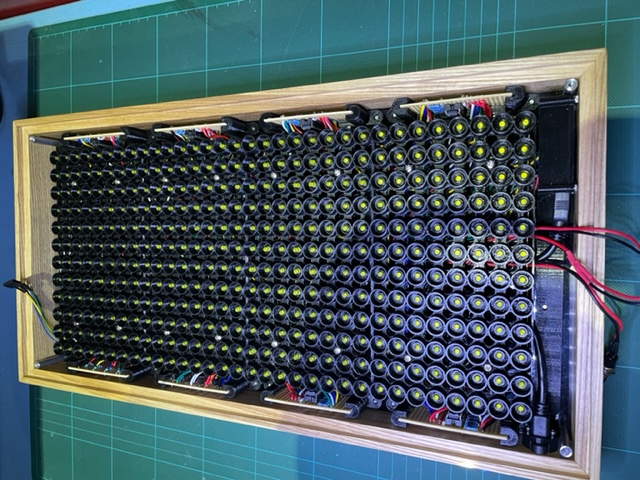 

Note the funky arduino mounting in the bottom right.

I didn't want to drill any more holes in the back plate so here you can see a tab from the arduino mount reaching right across the bottom of the box to where the original mounting holes are on the left. See also that I had to shift the whole thing towards the bottom of the calendar to ensure that the up button had clearance from the USB cable coming out of the arduino!

It was tense drilling a 16mm hole through the frame. The result for the USB came out alright:

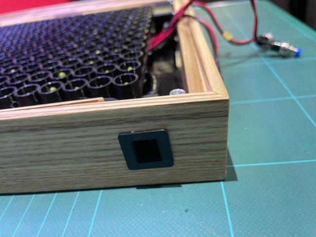

Did I mention that I ditched the front panel lenses, in favor of 3d printed diffuser sheets:

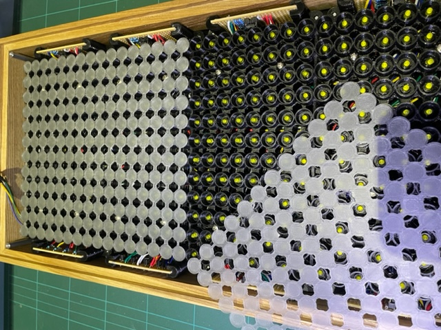

Both diffusers in place. There is raised bit on the back for each LED socket. The sheet locks into place and are held there purely by the front panel ensuring these raised bits are keyed into the LED socket:

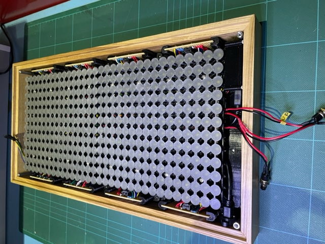 

Buttons in place on front panel, about to insert I2C socket into the LED Panel at the top:

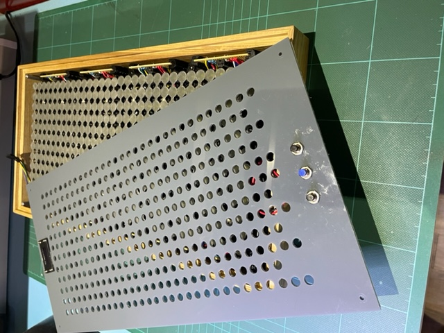 

## Finished

Finally finished:

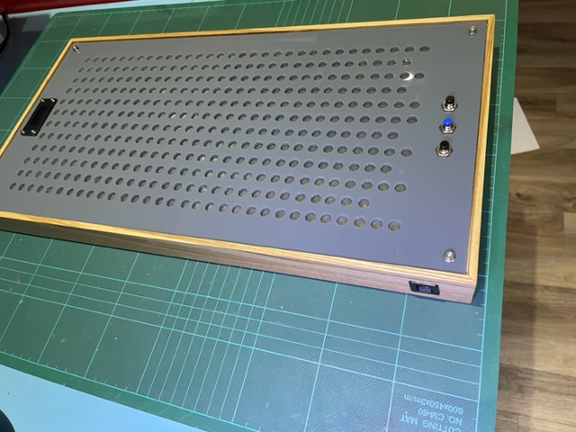 

.. and in operation. Note that it looks like the LEDs are not all lined up correclty. This is just the angle of the camera. When looking straight on, all LEDs line up in their respective holes.

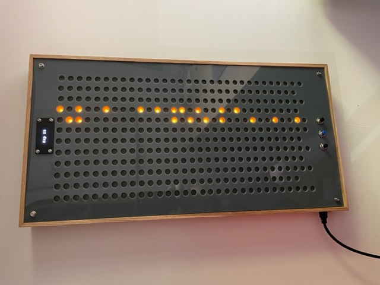 

I have been using the calendar from when it was first operational. The days are showing my running days since August.

Note that this is on maximum brightness. You can adjust the brightness by holding the select button and toggling either the up or down buttons.

The currently selected date on the LED Panel also only shows when a button is pressed. It then turns off after a period of inactivity.

